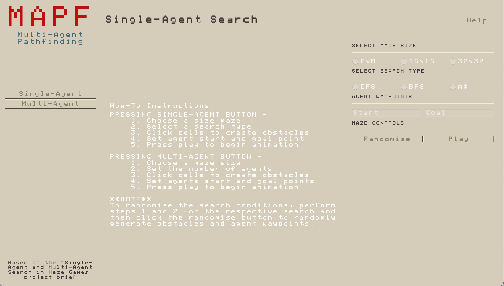
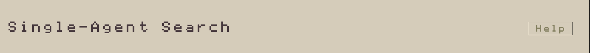
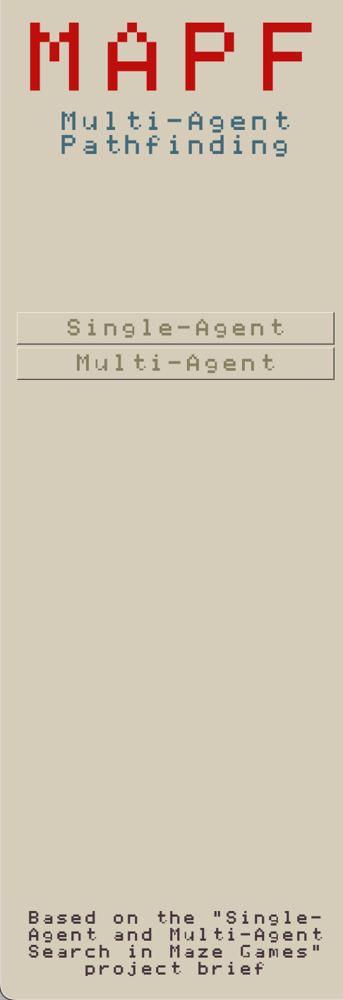
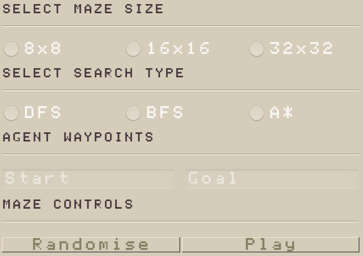
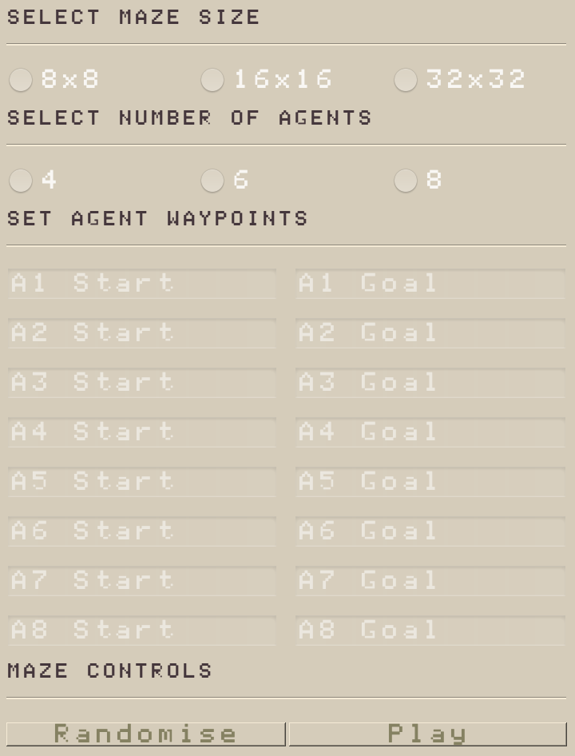
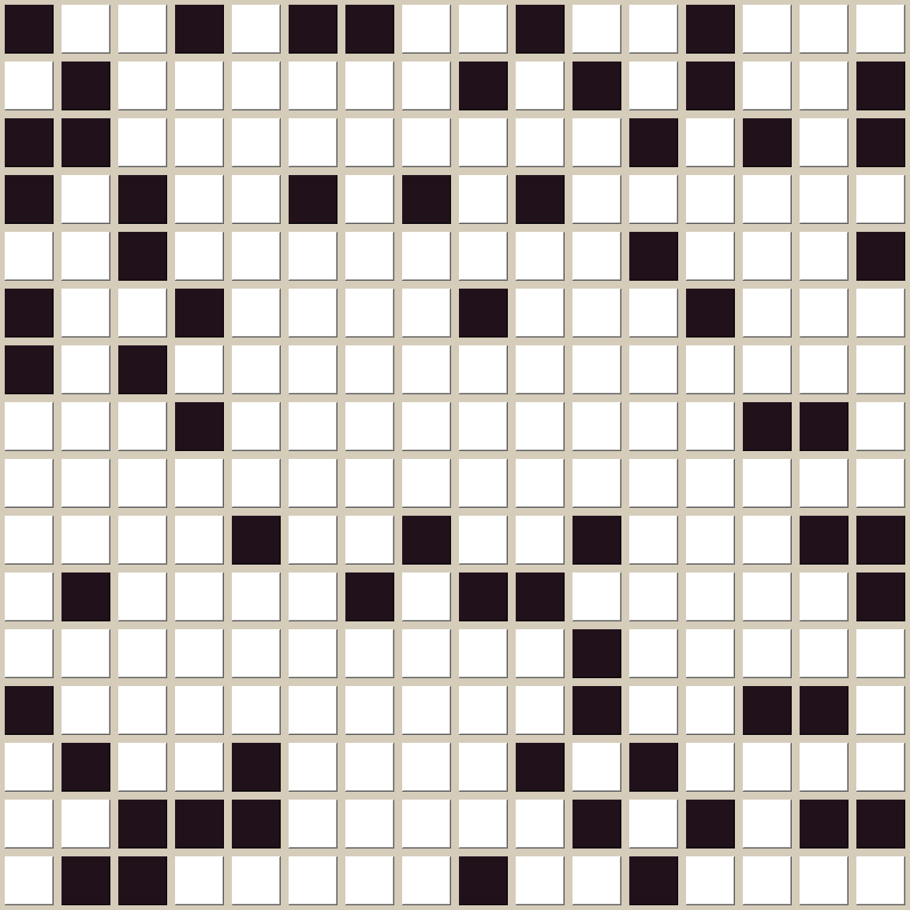
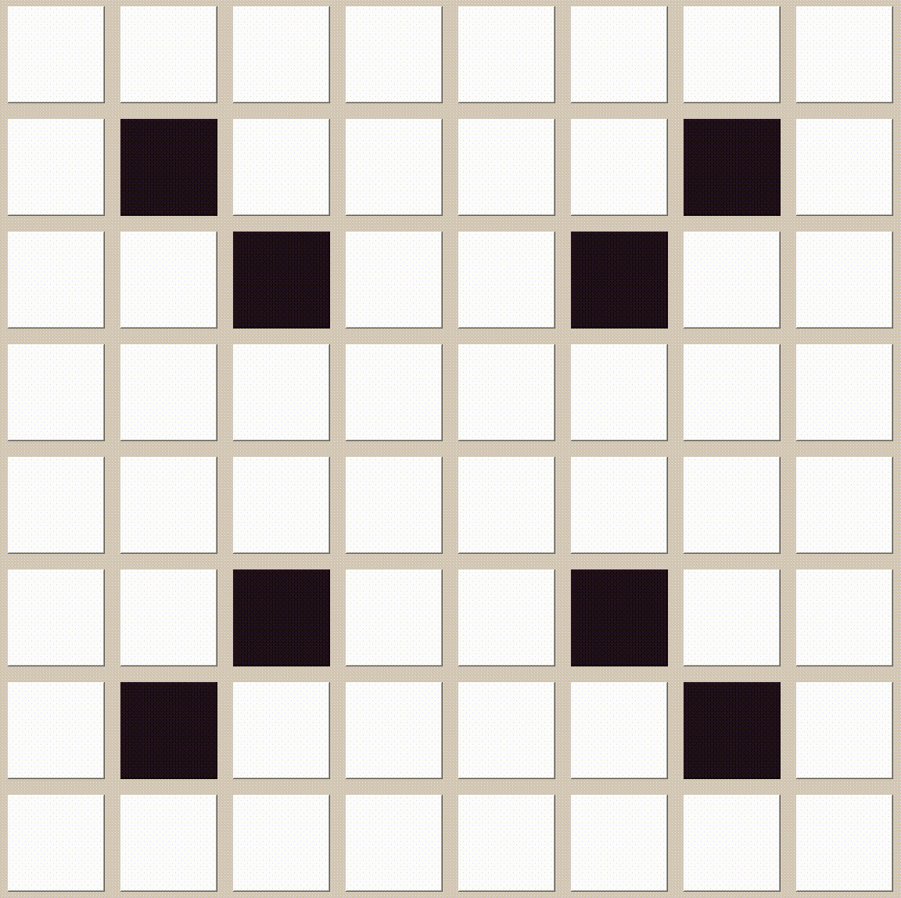
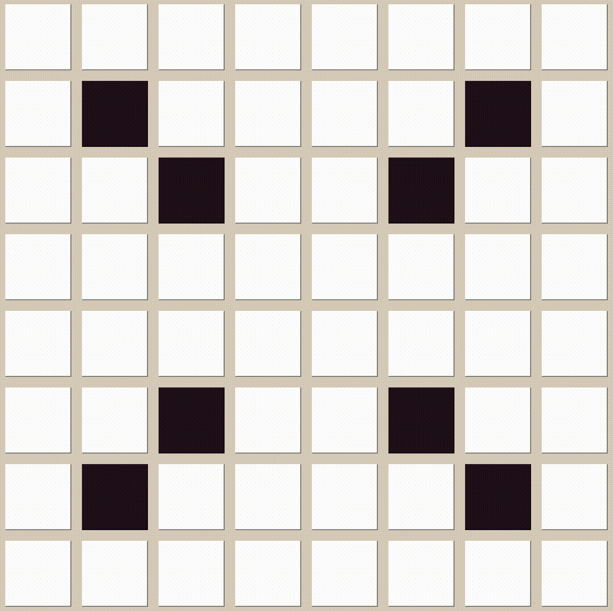
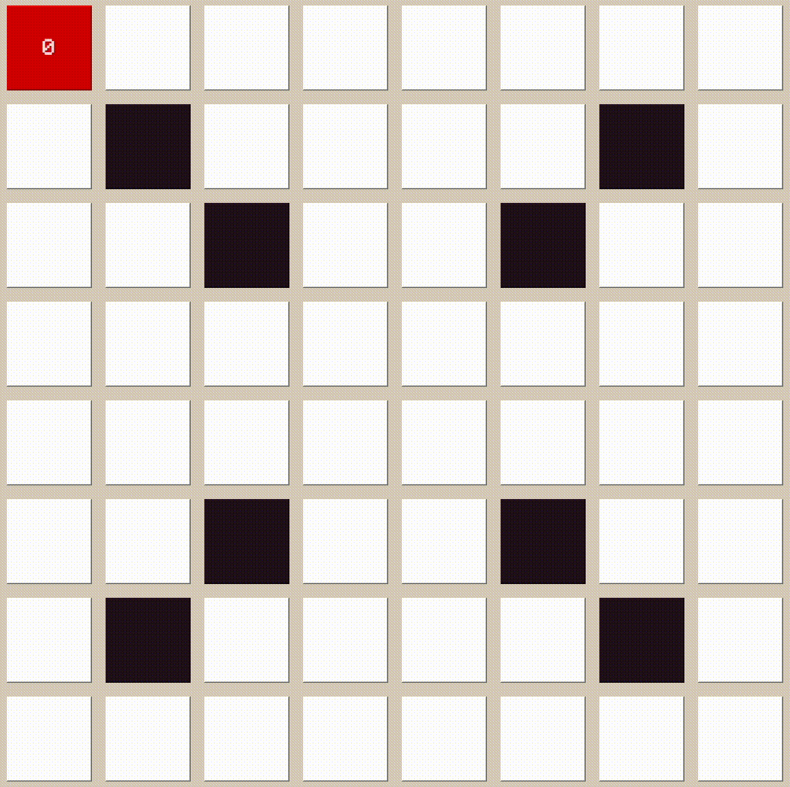
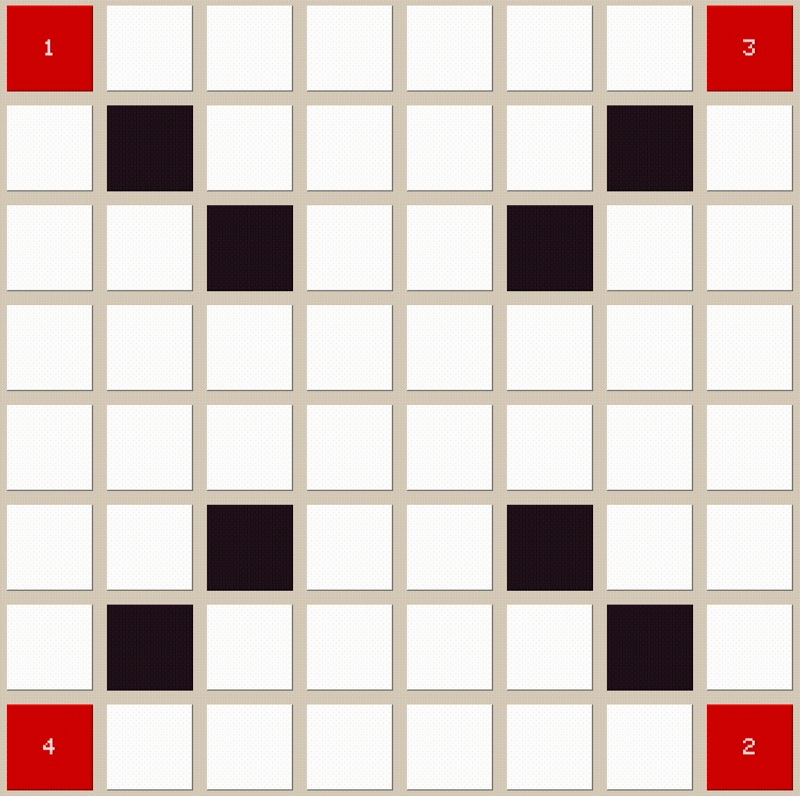

# Final Year Project

## Overview

Final Year Project demonstrating Multi-Agent Pathfinding (MAPF).

The aim of this project is to provide a number of Single-Agent and Multi-Agent Search algorithms that are able to traverse throughout an environment.

Each of the provided algorithms can be manipulated and visualised using the built-in user interface.

## Requirements

- Python [3.10] - https://www.python.org/downloads/
- PyQt [5] - https://pypi.org/project/PyQt5/

PyQt can be installed using pip by running the following command:
```bash
pip install PyQt5 
```

## Build Instructions

1. Clone the repository:
```bash
git clone https://github.com/olijbrown/pyMAPF
cd pyMAPF
```

2. Run the application:
```bash
python3 main.py
```

## How-To Guide

The first time you open the application you will see the following interface:



|                                Menu Component                                 |                                                                                                                                                                                                                                     Description                                                                                                                                                                                                                                      |
|:-----------------------------------------------------------------------------:|:------------------------------------------------------------------------------------------------------------------------------------------------------------------------------------------------------------------------------------------------------------------------------------------------------------------------------------------------------------------------------------------------------------------------------------------------------------------------------------:|
|       (HEADER)       |                                                                                                The header of the application provides you with an indication of the current state. The title in the header will tell you if you are currently performing a Single-Agent or Multi-Agent Search. The 'Help' button on the left side will a 'How-To Guide' will appear for you to read.                                                                                                 |
|      (SIDEBAR)      |                                                                                        The sidebar is used to set the type of search you would like to perform. When pressing the 'Single-Agent' button, the application will supply you with the menu to perform Single-Agent Searches (DFS, BFS, A*). Selecting the Multi-Agent button will show the menu for performing the CBS algorithm.                                                                                        |
|  (SINGLE-AGENT MENU) | The Single-Agent menu provides a way for you to set the parameters of a Single-Agent Search. There are three size mazes to select from the menu: small (8x8), medium (16x16) and large (32x32). After selecting a size maze, you can choose between the different Single-Agent searches: DFS, BFS and A*. The menu also provides you a way to randomise the conditions of the search you have selected. After setting the parameters, you can play the search animation on the maze. |
|  (MULTI-AGENT MENU)  |           The Multi-Agent menu allows you to set the parameters for a Conflict-based Search. The maze is set in the same way as in the Single-Agent menu. The Conflict-Based Search can be performed with 4, 6 or 8 agents that can be selected from the menu. Waypoints for each agent can be set using the 8 agent inputs which can be used to set the start and goal points of each agent. The randomise and play buttons perform the same as in the Single-Agent Menu.           |
|         (MAZE)         |                                                                    After setting the maze a visualisation will appear on the interface. This is where you are allowed to directly manipulate the the maze to create your desired layouts. Each cell of the maze is a clickable button. When a cell is clicked, its state is toggled meaning that it is changed from an open space to an obstacle and vice-versa.                                                                     |

## Example Outputs

### Depth-First Search

|          8x8 Example           |          32x32 Example           |
|:------------------------------:|:--------------------------------:|
|  |  |

### Breadth-First Search

|          8x8 Example           |          32x32 Example           |
|:------------------------------:|:--------------------------------:|
|  |  |

### A* Search

|           8x8 Example            |           32x32 Example            |
|:--------------------------------:|:----------------------------------:|
|  |  |

### Conflict-Based Search

|    8x8 Example w/ 4 Agents     |    32x32 Examples w/ 8 Agents    |
|:------------------------------:|:--------------------------------:|
|  |  |
